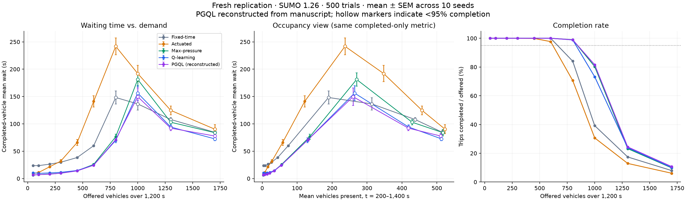

# GarSef: Adaptive Traffic Light Control

My research looks at a straightforward question: **how can traffic lights respond to changing traffic conditions to reduce the time drivers spend waiting?**

I study this using a simulated 3x3 urban road grid in SUMO. I compare fixed-time signals with adaptive controllers and reinforcement learning, looking at both average waiting time and what happens as the network becomes congested.

This repository contains the code, data, and analysis for a replication of the experiments described in my paper, *Pressure-Guided Q-Learning: A Warm-Started Hybrid Controller for Signalised Urban Grids*.

## What I am comparing

There are five controllers in this study:

| Controller | How it makes decisions |
|---|---|
| Fixed-time | Follows the signal schedule built into the network. |
| Actuated | Responds to traffic on the approaches, ending a green early when the served lanes are empty. |
| Max-pressure | Selects a green phase using the difference between upstream and downstream queues. |
| Q-learning | Learns when to hold or switch the signal from its experience in the simulation. |
| Pressure-Guided Q-Learning (PGQL) | Starts with a preference for following max-pressure, then learns when to hold or choose the other green phase. |

The idea behind PGQL is to give the learner a useful starting policy. Instead of starting with no preference, its initial Q-values favor the max-pressure recommendation. With exploration disabled, the reconstructed untrained policy matches max-pressure in the validation runs. Once exploration and learning are introduced, its performance needs to be measured; the warm start alone does not guarantee that it will always perform better.

## How the experiments work

The replication uses **SUMO 1.26.0**, with Python controlling the signals through libsumo. Each trial offers vehicles over a 1,200-second loading window and runs for up to 1,800 seconds.

The evaluation covers:

- Five controllers.
- Ten traffic loads, from 50 to 1,700 offered vehicles.
- Ten random seeds per controller and load.
- **500 evaluation simulations**, following 20 Q-learning and 16 PGQL training episodes.

I use mean waiting time per completed vehicle as the main comparison, alongside the fraction of offered vehicles that finish their trips and the average number of vehicles present in the network. The analysis also fits an occupancy-based capacity model and compares PGQL with max-pressure using paired statistical tests.

## What the replication shows

The results reproduce some parts of the paper closely, but **they do not reproduce every reported result**.

At a load of 200 offered vehicles, the mean waiting times are:

| Controller | Reported in the paper | Fresh replication |
|---|---:|---:|
| Fixed-time | 26.27 s | 26.27 s |
| Actuated | 21.50 s | 21.49 s |
| Max-pressure | 8.34 s | 8.30 s |
| Q-learning | 7.92 s | 10.29 s |
| PGQL | 11.67 s | 7.88 s |

Each value is an average across ten evaluation seeds. All 90 available historical trial results for the three non-learning controllers matched the fresh simulations exactly.

The reconstructed PGQL controller improves on max-pressure at 1,300 offered vehicles, with an unadjusted paired p-value of 0.0039. The paper's significant improvement at 1,700 vehicles and its low-load penalty were not reproduced. These comparisons use one trained policy per learner, so they do not capture variation between independent training runs.



The [full replication report](REPLICATION_REPORT.md) includes the uncertainty estimates, statistical tests, capacity fits, and implementation differences.

## Important context for these results

The original PGQL implementation was not available in the recovered project files. **The PGQL code here is a reconstruction based on the paper's description**, while the four baseline controllers and road network come from the project backup. This makes the experiment a replication attempt rather than an exact replay of the original PGQL study. No parameters were tuned to force a match with the paper.

There are also differences between the recovered code and the written methodology. For example, the network contains nine signal IDs, but four corner signals remain permanently green. The report documents this and other details that affect interpretation.

One limitation is especially important at high traffic loads: mean waiting time only includes vehicles that finish. A lower mean can therefore hide vehicles still stuck in the network. Plotting that same metric against occupancy does not remove this bias, which is why I report completion rates alongside waiting time.

## Finding the code and data

| File or folder | Contents |
|---|---|
| `controllers/` | The five controller implementations. |
| `net/` | The SUMO road network. |
| `run_one.py` | The simulation engine used for individual trials. |
| `replicate.py` | Training and the full 500-trial evaluation. |
| `analyze.py` | Summary statistics, paired tests, capacity fits, and plots. |
| `validate_replication.py` | Deterministic reruns and warm-start checks. |
| `replication_results/` | Fresh measurements, training logs, policy tables, and analysis outputs. |
| `original_backup/` | Recovered source and historical data, kept separately from fresh results. |

For the measurements, start with [fresh_runs.csv](replication_results/fresh_runs.csv) and [summary.csv](replication_results/summary.csv). The [manifest](replication_results/manifest.json) records experiment settings, package versions, and source hashes. The [validation results](replication_results/validation.json) record the reproducibility checks.

`run_all.py` is the older four-controller script. **Use `replicate.py` for the experiments presented here.**

## Running the experiments

The setup below is for Windows with Python 3.12. Open PowerShell in the repository folder and create the environment:

```powershell
py -3.12 -m venv .venv
.\.venv\Scripts\python.exe -m pip install -r requirements.txt
```

Then run the experiment, validation, and analysis:

```powershell
.\.venv\Scripts\python.exe replicate.py --workers 4
.\.venv\Scripts\python.exe validate_replication.py
.\.venv\Scripts\python.exe analyze.py
```

The local runner resumes saved trial records and checks that the source and settings have not changed. For a completely fresh run, rename the existing `replication_results` folder first so the previous results remain available for comparison. Individual trial JSON files are excluded from Git; a GitHub clone can regenerate them by running the experiment.
